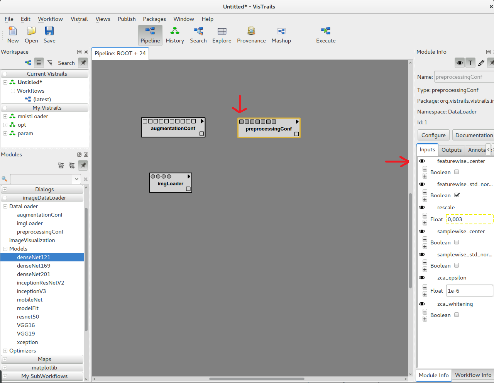

# Image-Workflow-Tutorial
# First Steps into Keras Image Modules

## Keras Package

### Setting up

The Keras Package can be easil installed via pip through the terminal. If you're using unix, type;

     sudo pip install keras

We will also need to install matplotlib for some modules. As the same before, we can type;

    sudo pip install matplotlib

And it will be installed, after this you would be able to use all components of vistrail's image modules

## Getting Started

The module must be enabled first for use. Acess Edit -> Packages and select the package imgDataLoader.


## Loading your own image dataset

Using the imageDataLoader module (It probably will have its name changed to something like 'image - Keras'), we can see 3 groups in there. They are the DataLoader, the Models and the Optimizers as the following image:


After this we will select the DataLoader group, and within it we will choose imgLoader and drag to our workflow, also on the right side we can see all of its parameters, as we can see above :


Also on the right side we can set our parameters, as you can see we had put all required parameters to make this module work ( we can see those parameters as the ones who starts with an eye open near its name). To set a parameter we can click at its label and a box beneath it will appear with its type on the left, after this we just put what we want in this blank box. Here is an example of its parameters sets :


We had put a part of MNIST dataset (the training part) in this imgLoader, on img_Path we set a path for a folder where there are 10 folders containing each class of MNIST from 0 to 9. (The size of the image is set to 32x32 since we will use a MobileNet wich its minimum size is also 32x32).

After that we added some augmentation and preprocessing modules (as you can see all parameters on those modules are optional [with its eye closed] ) :


To show optional parameters on the box module we can click on the eye and it will be open and will be shown on the box as following:




And as you can see before there are 2 parameters on imgLoader for augmentation and preprocessing but they are optional (the eyes are closed) you can put it to be shown clicking on the eye and it will appear on the box. To link those modules just drag the output from augmentation and preprocessing module to the corresponding input in the imgLoader module (if you drag to a square in the module and wait a second it will pop-up the name of wich parameter it is in the square that you are). 

## Creating a model to use your own dataset

First we need to choose wich optimizer we will use on our model, we go to the group in the left called Optimizers and pick wich one we want and as before we set its parameters on the right, here we will use and Adam optmizer.


Now we can add a model to attach our optmizer module, and also add its parameters as we have been doing. We will use in our demonstration the MobileNet model. For the Loss and the Metrics we need to know wich one do we want since we need to write a string of the name of wich of them we will use.


At this time we need to stick together our dataset and our model, for this we will need the "modelFit" module. We can choose it from models group on the left and put it on the workflow then we can drag the output from our 2 parts of dataset ( train/test ) and put it on the respective place on modelFit, same for MobileNet.
Also we need to define how much Epochs and steps in each epoch we want to have and how much validation steps we want too.


Using Ctrl+L to Re-Layout this to become more aesthethic we will have this. 


For visualization we can choose the ImageVisualization Module, you just need to attach an imgLoader module to it, and it you give some exemples of how de dataset are.


After all, we now just need to click on Execute and it you be done. The workflow shoud be like this ( with all modules green ):


There will be some outputs, from imageVisualization we will receive a batch of the image dataset and will be able to see how it is after preprocessing and augmentation modules, from modelFit we are going to have a graph with the loss and accuracy plotted in. And in console we will be able to see the parameters of augmentation, preprocessing and optmizer.


And at the end those are the outputs.

We also run a Resnet50 with Adam Optimizer and 1000 epochs on Cifar10 , the outputted images and  graph are these:


```python

```
